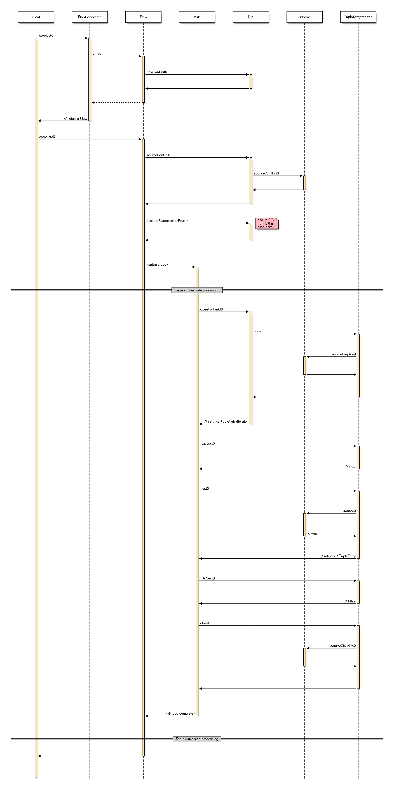
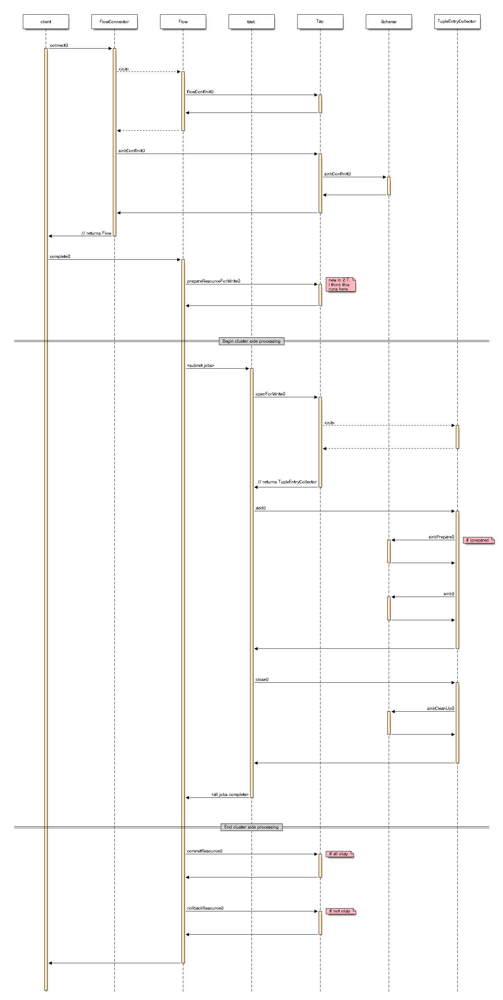

#Overview
Created with [seqdiag](http://blockdiag.com/en/seqdiag/).

#Usage
    seqdiag source.diag ; open -a "Preview" source.png
    seqdiag sink.diag ; open -a "Preview" sink.png 

#Source

#Sink

