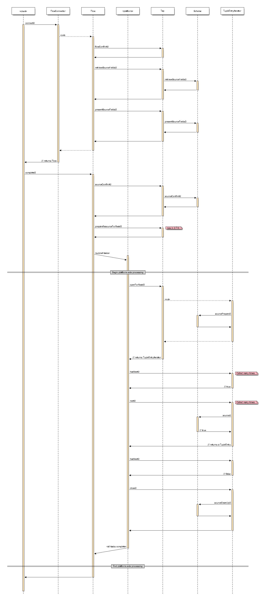

#Overview
Created with [seqdiag](http://blockdiag.com/en/seqdiag/) and excessive use of `^⌥H` in Eclipse.

Note that within the diagrams the `<client>` and `<task>` components represent the tool and job-task in MapReduce nomenclature. These are considered an abstract boundary point because as Cascading developers we rarely care, understand, or know what these look like internally. They are considered black-boxes, implementing the Cascading runtime on some execution engine but exercising the public `Tap` API in a contractual manner. All other components map to their respective classes within the Cascading API.

#Usage
    seqdiag source.diag ; open -a "Preview" source.png
    seqdiag sink.diag ; open -a "Preview" sink.png 

#Source

#Sink
Notes:

* It's odd that the sink is initialised when the `FlowDef` is connected and not when the `Flow` is constructed, as is the case with the source.
* If the flow fails then `rollbackResource()` is invoked instead of `commitResource()`.

