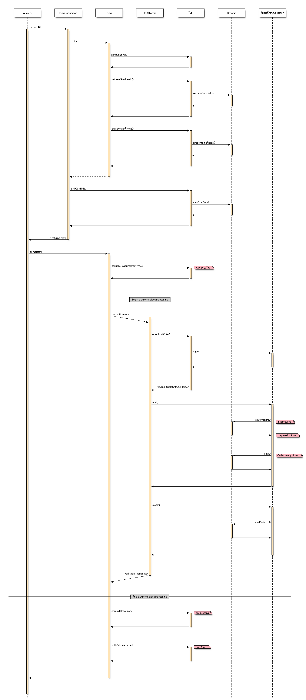

#Overview
Sequence diagrams describing the standard life-cycles in Cascading's API. This should be considered an illustrative approximation that outlines the salient interactions that are usually of interest to the developers of extensions to Cascading. Currently the diagrams are limited to the `Tap` and `Scheme` components.

Analysis was performed against Cascading's Hadoop platform classes for version 2.7.0. Note that this sequence may differ for different platforms and/or versions. Created with [seqdiag](http://blockdiag.com/en/seqdiag/) and excessive use of `^⌥H` in Eclipse, and hence prone to human error.

Note that within the diagrams the `<client>` and `<platform>` components represent the tool and job-task in MapReduce nomenclature. These are considered an abstract boundary point because as Cascading developers we rarely care, understand, or know what these look like internally. They are considered black-boxes, implementing the Cascading runtime on some execution engine but exercising the public API in a contractual manner. All other components map to their respective classes within the Cascading API.

#Usage
    ./build.sh
    
#Source

#Sink
Notes:

* It's odd that the sink is initialised when the `FlowDef` is connected and not when the `Flow` is constructed, as is the case with the source.
* If the flow fails then `rollbackResource()` is invoked instead of `commitResource()`.

#Credits

Created by [Elliot West](https://github.com/teabot) with thanks to Ken Krugler and Koert Kuipers.

#License
These diagrams are available under the [Apache 2.0 License](http://www.apache.org/licenses/LICENSE-2.0.html).
